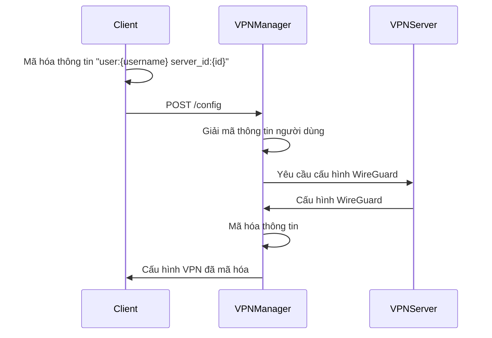

# Hướng dẫn sử dụng API OpenVPN Management

## Giới thiệu

Tài liệu này mô tả các API của hệ thống OpenVPN Management và luồng giao tiếp giữa ứng dụng client và server VPN Manager. Hệ thống sử dụng các cơ chế bảo mật như mã hóa RSA và AES để đảm bảo tính bảo mật trong quá trình truyền thông.

## Mô hình hoạt động

Hệ thống OpenVPN Management hoạt động theo mô hình Client-Server, trong đó:

1. **Máy khách (Client)**: Ứng dụng người dùng gọi các API để:
   - Lấy danh sách máy chủ VPN
   - Lấy khóa RSA để mã hóa thông tin
   - Nhận cấu hình VPN (WireGuard) để kết nối

2. **Máy chủ (Server)**: Quản lý danh sách server VPN, xử lý yêu cầu từ client và tương tác với các máy chủ VPN thực tế.

## Luồng xử lý chính

### 1. Khởi tạo kết nối an toàn


### 2. Lấy danh sách server VPN


### 3. Lấy cấu hình VPN



## API Reference

### RSA Controller

#### 1. Lấy Public Key
```
GET /key/{username}
```

**Mô tả:** Tạo cặp khóa RSA mới cho người dùng và lưu trữ trong Redis. Trả về public key cho client.

**Tham số:**
- `username`: Tên người dùng cần tạo khóa

**Phản hồi thành công:**
```json
{
  "key": "[public_key_string]"
}
```

**Mã trạng thái:** 201 Created

#### 2. Lấy thông tin tất cả người dùng (chỉ cho mục đích gỡ lỗi)
```
GET /key/all
```

**Mô tả:** Trả về thông tin về tất cả các khóa người dùng được lưu trữ.

**Phản hồi thành công:**
```json
{
  "message": "Ok"
}
```

### Server Controller

#### 1. Danh sách Server
```
GET /listServer
```

**Mô tả:** Trả về danh sách tất cả các máy chủ VPN có sẵn đã được mã hóa AES.

**Phản hồi thành công:**
```json
{
  "message": "[encrypted_server_list]"
}
```

**Giải mã dữ liệu:** Client cần sử dụng khóa AES được cung cấp trước để giải mã dữ liệu. Sau khi giải mã, chuỗi JSON sẽ chứa mảng các đối tượng server với thông tin sau:
```json
[
  {
    "id": 1,
    "IP": "https://example.com",
    "country": "Vietnam",
    "city": "Ho Chi Minh",
    "flag": "vn.png",
    "isFree": true,
    "category": "Free",
    "description": "Server VPN tại Việt Nam",
    "latitude": "10.762622",
    "longitude": "106.660172",
    "region": "Ho Chi Minh City",
    "postal": "70000"
  }
]
```

#### 2. Thêm Server
```
POST /server
```

**Mô tả:** Thêm một máy chủ VPN mới vào hệ thống.

**Body:**
```json
{
        "IP": "http://3.139.103.95:10086",
        "category": "Videos",
        "description": "Telemundo",
        "flag": "https://flagcdn.com/w320/us.png",
        "isFree": true
}
```

**Phản hồi thành công:**
```json
{
  "message": "Server added successfully"
}
```

**Mã trạng thái:** 201 Created

#### 3. Thêm nhiều Server
```
POST /server/list
```

**Mô tả:** Thêm nhiều máy chủ VPN cùng lúc.

**Body:**
```json
[
    {
        "IP": "http://3.139.103.96:10086",
        "category": "Videos",
        "description": "Telemundo",
        "flag": "https://flagcdn.com/w320/us.png",
        "isFree": true
    },
    {
        "IP": "http://3.139.103.95:10086",
        "category": "Videos",
        "description": "Telemundo",
        "flag": "https://flagcdn.com/w320/us.png",
        "isFree": true
    }
]
```

#### 4. Lấy cấu hình VPN
```
POST /config
```

**Mô tả:** Lấy cấu hình WireGuard cho kết nối VPN. Thông tin người dùng và server được mã hóa RSA.

**Body:**
```json
{
  "message": "[encrypted_message]",
  "public_key": "[client_public_key]",
  "user": "username"
}
```

**Lưu ý:** `encrypted_message` là chuỗi được mã hóa của chuỗi gốc "user:{username} server_id:{id}"

**Phản hồi thành công:**
```json
{
  "certificate": "[encrypted_certificate]",
  "config": "[wireguard_config_template]"
}
```

**Mã trạng thái:** 200 OK

#### 5. Danh sách Server (Admin)
```
GET /admin/listServer
```

**Mô tả:** Trả về danh sách tất cả các máy chủ VPN có sẵn không mã hóa (chỉ dành cho admin).

**Headers:**
```
Authorization: admin
```

**Phản hồi thành công:**
```json
{
  "message": [
    {
      "id": 1,
      "IP": "https://example.com",
      "country": "Vietnam",
      "city": "Ho Chi Minh",
      "flag": "vn.png",
      "isFree": true,
      "category": "Free",
      "description": "Server VPN tại Việt Nam",
      "latitude": "10.762622",
      "longitude": "106.660172",
      "region": "Ho Chi Minh City",
      "postal": "70000"
    }
  ]
}
```

**Mã trạng thái:** 200 OK

**Mã lỗi:**
- 403 Forbidden: Nếu API key không chính xác hoặc không được cung cấp

**Cách sử dụng:**
```bash
curl -H "Authorization: admin" http://ip_server:4000/admin/listServer
```

#### 6. Xóa Server Theo ID
```
DELETE /server/{id}
```

**Mô tả:** Xóa một máy chủ VPN dựa trên ID của nó.

**Tham số URL:**
- `id`: ID của server cần xóa

**Headers:**
```
Authorization: admin
```

**Phản hồi thành công:**
```json
{
  "message": "Server deleted successfully"
}
```

**Mã trạng thái:** 200 OK

**Cách sử dụng:**
```bash
curl -X DELETE -H "Authorization: admin" http://localhost:4000/server/1
```

**Lưu ý bảo mật:**
- API này chỉ nên được sử dụng bởi người quản trị
- Hành động xóa là không thể hoàn tác, hãy cẩn thận khi sử dụng

#### 7. Xóa Server Theo IP
```
DELETE /server/ip
```

**Mô tả:** Xóa một máy chủ VPN dựa trên địa chỉ IP của nó.


**Body:**
```json
{
  "ip": "http://3.139.50.2:10086"
}
```

**Headers:**
```
Authorization: admin
Content-Type: application/json
```

**Phản hồi thành công:**
```json
{
  "message": "Server deleted successfully"
}
```

**Mã trạng thái:** 200 OK

**Mã lỗi:**
- 400 Bad Request: Nếu không cung cấp IP trong request body
- 404 Not Found: Nếu không tìm thấy server với IP được chỉ định
- 500 Internal Server Error: Nếu xảy ra lỗi trong quá trình xóa

**Cách sử dụng:**
```bash
curl -X DELETE -H "Content-Type: application/json" -H "Authorization: admin" -d '{"IP": "http://3.139.50.2:10086"}' http://ip_server:4000/server/ip
```

**Lưu ý:**
- API này là một phương pháp thay thế để xóa server khi bạn biết địa chỉ IP nhưng không biết ID
- Địa chỉ IP phải khớp chính xác với giá trị được lưu trong cơ sở dữ liệu

## Quy trình sử dụng

### Bước 1: Khởi tạo kết nối an toàn
1. Gọi API `GET /key/{username}` để nhận public key từ server
2. Lưu public key để sử dụng cho việc mã hóa thông điệp sau này

### Bước 2: Lấy danh sách server VPN
1. Gọi API `GET /listServer` để nhận danh sách server đã mã hóa
2. Sử dụng khóa AES (mặc định là "SMJUH41TkNyChU8c5kWPiA==") để giải mã danh sách server
3. Hiển thị danh sách server để người dùng lựa chọn

### Bước 3: Lấy cấu hình VPN
1. Khi người dùng chọn một server VPN, tạo chuỗi thông tin: "user:{username} server_id:{id}"
2. Sử dụng public key từ bước 1 để mã hóa chuỗi này
3. Gọi API `POST /config` với thông tin đã mã hóa, public key và tên người dùng
4. Nhận cấu hình WireGuard đã mã hóa từ server
5. Giải mã thông tin sử dụng khóa RSA
6. Sử dụng cấu hình WireGuard để thiết lập kết nối VPN

## Cơ chế bảo mật

Hệ thống sử dụng kết hợp hai cơ chế mã hóa:

1. **Mã hóa RSA**: Sử dụng cho việc truyền thông tin  từ client đến server
   - Độ dài khóa: 2048 bit
   - Client sử dụng public key của server để mã hóa
   - Server sử dụng private key để giải mã

2. **Mã hóa AES**: Sử dụng cho việc mã hóa danh sách server
   - Chế độ mã hóa: ECB
   - Cùng một khóa AES được sử dụng trên client và server
